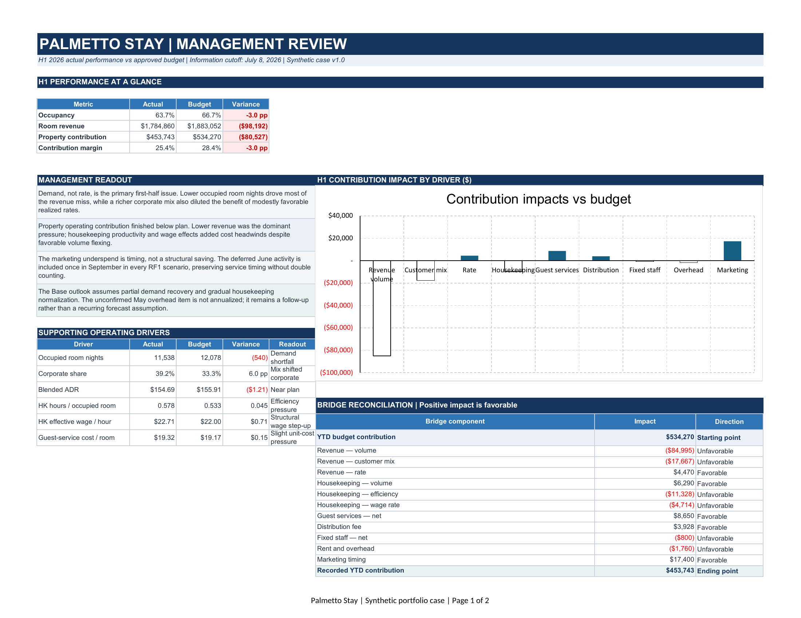
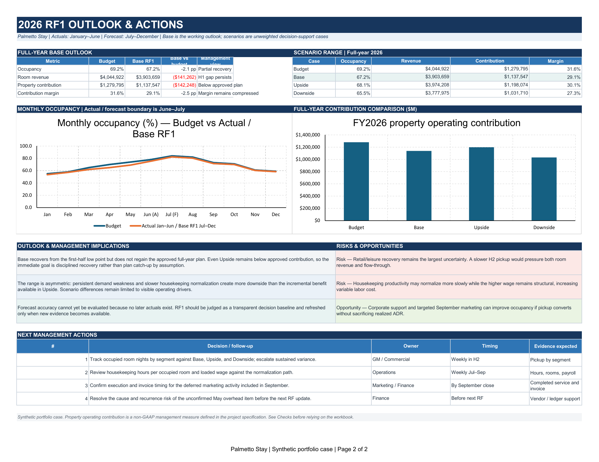

# Palmetto Stay — Operating Performance Review & Reforecast

An Excel-based FP&A portfolio case for a fictional 100-room limited-service hotel. The project follows a governed path from frozen synthetic source facts through an approved operating budget, H1 actual-versus-plan analysis, a driver-based RF1 reforecast, scenarios, and a two-page management review.

> **Status:** Portfolio Release `v1.0` is complete. The budget, actual-performance analysis, variance bridges, and RF1 scenarios were independently reconstructed and adversarially reviewed within the project’s stated scope. Native Excel, the workbook package, the management-review PDF, both PNG previews, and all repository-relative links passed final validation.

> **Synthetic-case disclosure:** Palmetto Stay is fictional. All company-specific historical results, budgets, actuals, operating records, staffing information, and management updates are synthetic and contain no confidential information. Public references inform selected definitions and modeling discipline only.

**Main conclusion:** H1 2026 room revenue was `$98,191.74` below budget and property operating contribution was `$80,526.59` below budget, led by lower occupied room nights. Base RF1 projects FY2026 property operating contribution of `$1,137,547.18`, below the approved budget of `$1,279,795.41`; even the Upside case remains below plan.

## Review the case

- [Download the Excel model](model/Palmetto_Stay_FP&A_Model.xlsx)
- [Open the two-page management review](outputs/Palmetto_Stay_Management_Review.pdf)
- [View management review — page 1](outputs/management_review_page_1.png)
- [View management review — page 2](outputs/management_review_page_2.png)
- [Read the case brief](docs/case_brief.md)
- [Review methodology and sources](docs/methodology_and_sources.md)
- [Inspect the project specification](docs/PROJECT_SPEC.md)

## Management-review preview

[](outputs/Palmetto_Stay_Management_Review.pdf)

[](outputs/Palmetto_Stay_Management_Review.pdf)

## What the work demonstrates

- A formula-driven FY2026 operating budget built from frozen monthly drivers.
- January–June actual performance linked to recorded source facts, with derived hotel and labor KPIs.
- Reconciled revenue volume/mix/rate and operating-cost driver bridges.
- A property operating contribution bridge with explicit sign conventions.
- A 2026 RF1 Base case using H1 actuals plus an evidence-based H2 forecast.
- Bounded Upside and Downside cases driven by operating assumptions rather than blanket financial shocks.
- A concise, formula-linked management review with three decision-useful charts and four owned follow-ups.
- A terminal `Checks` sheet with 179 passing controls and no downstream dependency.
- An independent Phase 6 reconstruction of the approved budget, H1 actuals, variance attribution, and all three RF1 cases, followed by native Excel and published-output validation.

## Fast reviewer path

1. Start with the [two-page PDF](outputs/Palmetto_Stay_Management_Review.pdf) for the conclusions, scenario range, risks, and actions.
2. Open the [Excel model](model/Palmetto_Stay_FP&A_Model.xlsx) on `Start` and follow the workflow through `Data`, `Assumptions`, `Budget`, `Variance`, `Forecast`, and `Review`.
3. Finish on `Checks` to inspect source integrity, model mechanics, bridge reconciliation, forecast boundaries, review links, and output controls.

## Workbook architecture

The workbook contains exactly eight visible worksheets in this order:

1. `Start` — purpose, navigation, conventions, and build status.
2. `Data` — frozen recorded actuals and dated case updates.
3. `Assumptions` — approved budget drivers and the separate RF1 scenario layer.
4. `Budget` — monthly and full-year approved operating budget.
5. `Forecast` — Base, Upside, and Downside actual-plus-forecast cases.
6. `Variance` — YTD scorecard, monthly comparison, driver bridges, and evidence register.
7. `Review` — the two-page management-facing output exported to PDF.
8. `Checks` — terminal source, model, aggregation, architecture, and output controls.

The workbook has no macros, hidden worksheets, external workbook links, circular iteration, or volatile formulas. The approved budget remains frozen, January–June actuals are identical across scenarios, Upside and Downside detail is grouped and collapsed on `Forecast`, and no output worksheet depends on `Checks`.

## Case scope and conventions

The model covers room revenue, housekeeping payroll, guest-service expense, distribution/payment expense, fixed-staff payroll, rent, property overhead, marketing, and property operating contribution. It intentionally excludes ancillary operations, balance-sheet and cash-flow modeling, debt, valuation, daily booking analysis, employee-level planning, probability-weighted scenarios, and enterprise planning architecture.

Property operating contribution is room revenue less modeled property operating costs, including rent, before depreciation, financing, income taxes, and corporate overhead. It is a project-defined management measure, not GAAP operating income, EBITDA, cash flow, or standardized hotel GOP.

Expense schedules use `Actual cost − Budget cost`, where positive is unfavorable. The contribution bridge reverses expense effects so positive contribution impact is favorable. Revenue effects enter unchanged.

## Data and evidence boundary

Case version `v1.0` includes January–December 2025 actuals, January–June 2026 actuals, and the January–December 2026 approved budget assumption pack. The RF1 information cutoff is July 8, 2026. The private deterministic Case Builder remains outside this public repository; published CSVs are static and frozen.

RF1 forecast accuracy cannot yet be evaluated because no later actuals exist. Base, Upside, and Downside are transparent decision-support cases, not confidence intervals or probability-weighted outcomes.

## Repository contents

```text
palmetto-stay-fpa/
├── README.md
├── model/
│   └── Palmetto_Stay_FP&A_Model.xlsx
├── data/
│   ├── approved_budget_assumptions.csv
│   ├── financial_actuals.csv
│   ├── operating_actuals.csv
│   ├── labor_actuals.csv
│   └── case_updates.csv
├── docs/
│   ├── PROJECT_SPEC.md
│   ├── DECISION_LOG.md
│   ├── case_brief.md
│   └── methodology_and_sources.md
└── outputs/
    ├── Palmetto_Stay_Management_Review.pdf
    ├── management_review_page_1.png
    └── management_review_page_2.png
```

## Remaining limitations

- Palmetto Stay and all company-specific internal data are fictional and synthetic.
- Assumptions were designed for a portfolio case rather than adopted from a real operating company.
- The model covers one hotel and focuses on property operating contribution.
- It does not forecast a balance sheet or a full cash-flow statement.
- Base, Upside, and Downside are judgment-based decision cases, not probabilities or confidence intervals.
- RF1 forecast accuracy cannot be measured until later actual results exist.
- The project does not represent employment by, assurance for, or advice to a real company.

Portfolio Release `v1.0` completes Phase 6. Final artifacts are `model/Palmetto_Stay_FP&A_Model.xlsx`, `outputs/Palmetto_Stay_Management_Review.pdf`, `outputs/management_review_page_1.png`, and `outputs/management_review_page_2.png`.
